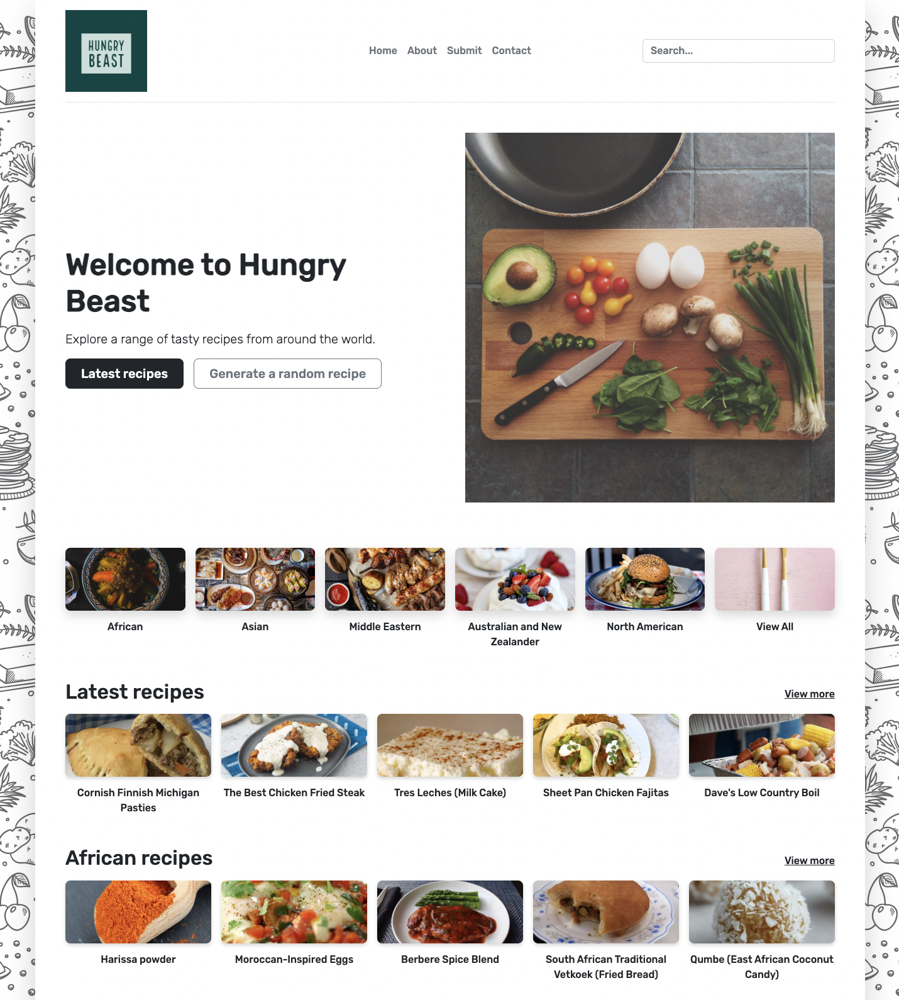

# *Hungry Beast*

*Hungry Beast* the recipe app is a backend project allowing users to access and search for recipes from different continents as well as submit their own recipes. The app fetches recipes from a database and passes the recipes to an Express server, where the recipes are then queried.


### Main features

- Categories of recipes sorted by continents
- Latest recipes
- Continental recipes
- Each recipe comes with description, instruction and ingredients
- Users can search for recipes containing specific ingredients
- Users can submit one recipe at a time in a form, where they have to fill in their email address, the recipe’s name, description, instructions, ingredients, category sorted by continents and upload the recipe’s image
- Users can submit enquiries in a form, where they have to fill in their name, email address and message

## Resources for creating the project

### Languages

- CSS
- JavaScript
- EJS

### Frameworks

- Bootstrap (CSS)
- Express.js (JavaScript)
- jQuery (JavaScript)

### Runtime environment

- Node.js (JavaScript)
### Database program

- MongoDB

### ODM library

- Mongoose

### Dependencies

- [aws-sdk](https://www.npmjs.com/package/aws-sdk)
- [axios](https://www.npmjs.com/package/axios)
- [body-parser](https://www.npmjs.com/package/body-parser)
- [connect-flash](https://www.npmjs.com/package/connect-flash)
- [cookie-parser](https://www.npmjs.com/package/cookie-parser)
- [cookie-session](https://www.npmjs.com/package/cookie-session)
- [dotenv](https://www.npmjs.com/package/dotenv)
- [ejs](https://www.npmjs.com/package/ejs)
- [express](https://www.npmjs.com/package/express)
- [express-ejs-layouts](https://www.npmjs.com/package/express-ejs-layouts)
- [formidable](https://www.npmjs.com/package/formidable)
- fs
- [jquery](https://www.npmjs.com/package/jquery)
- [jsdom](https://www.npmjs.com/package/jsdom)
- [lodash](https://www.npmjs.com/package/lodash)
- [mongodb](https://www.npmjs.com/package/mongodb?utm_medium=devmedia-synd&utm_source=devmedia&utm_content=serverless&jmp=devmedia-ref)
- [mongoose](https://www.npmjs.com/package/mongoose)
- [morgan](https://www.npmjs.com/package/morgan)
- [nodemailer](https://www.npmjs.com/package/nodemailer)
- [nodemon](https://www.npmjs.com/package/nodemon)

### Database

- [MyCookbook.io](https://rapidapi.com/mycookbook/api/mycookbook-io1) (Where the recipes are fetched from)

### References

- [Wireframing](https://www.figma.com/file/OiIt1zovdm9uL7CnTORsCF/Project-2-Wireframing?node-id=0%3A1)

- [API routes](https://docs.google.com/spreadsheets/d/1i1E82H9rPMkHY67rk9PUZV7OFFbpw13j3U0Z9-R-0Hk/edit#gid=0)
## Link to the project
https://floating-gorge-73473.herokuapp.com/

## Installation

### 1. In your computer’s or code editor’s terminal

- Run `git clone git@github.com:erinerinchan/Project-2-Recipe-App.git` for SSH key
- Run `cd Project-2-Recipe-App`
- Run `code .` to open the `Project-2-Recipe-App` folder up in a new code editor window

### 2. In the new window’s terminal

- Run `npm install`

### 3. In the `Project-2-Recipe-App` folder

- Create a `.env` file, and add the following to the file:

```
MONGODB_URI=[The connection string in your MongoDB account]
S3_ACCESS_KEY=[The access key ID in your Amazon Web Service account]
S3_SECRET_KEY=[The secret access key in your Amazon Web Service account]
S3_REGION=[The location of your bucket in your Amazon Web Service account]
S3_BUCKET=[The name of your bucket in your Amazon Web Service account]
API_KEY=[The X-RapidAPI-Key on MyCookbook.io in your RapidAPI account]
NODEMAILER_USER=[Your Gmail address]
NODEMAILER_PASS=[The Application specific password in your Google account]

```
*To check the `connection string` in your *MongoDB account*, click [here](https://github.com/erinerinchan/MongoDB/blob/main/README.md).

*To check the `access key ID`, `secret access key`, `location of your bucket` and `the name of your bucket` in your *Amazon Web Service account*, click [here](https://github.com/erinerinchan/Amazon-Web-Services/blob/main/README.md#access-key-id-and-secret-access-key).

*To check the `X-RapidAPI-Key` on *MyCookbook.io* in your *RapidAPI* account, click [here](https://github.com/erinerinchan/RapidAPI---MyCookbook.io/blob/main/README.md).

*To check the `Application specific password` in your Google account, click [here](https://github.com/erinerinchan/Nodemailer---app-password/blob/main/README.md).
### 4. In the window's terminal

- Run `git status` to make sure your `.env` file is not tracked
## Start the server

- Run `nodemon app.js` in the window's terminal, or open `http://localhost:3000` with your browser to see the result
## Deploy to Heroku
### 1. In the window’s terminal

- Run `brew install heroku/brew/heroku` (If you have never installed Heroku before)
- Run `heroku login` (If you haven’t logged in to your Heroku account)
- Run `heroku create` (This create another remote name `heroku` just like `origin`)
- Run `heroku addons:create papertrail`(This adds a service that will keep your logs)
- Run `heroku addons:create heroku-postgresql:hobby-dev`(This adds PostgreSQL)
### 2. Add env variables (except DATABASE_URL) to Heroku

- Via Heroku account
	- Login to the account, go to the dashboard and select your app
	- Go to `Settings >> Config Vars >> Reveal Config Vars`
	- Paste all the items from the `.env` file in the `Project-2-Recipe-App` folder

- Or via the window’s terminal / CLI
	- Run `heroku config:set KEY=value`
	- Paste all the items from the `.env` file in the `Project-2-Recipe-App` folder

- Add `NODE_ENV=production` to `Reveal Config Vars` in your Heroku account
### 3. In the window’s terminal

- Run `git push heroku [branch-name:]master` (add `branch-name` if you are not in the master branch)
- Run `heroku open`
## Support
If you run into any issues downloading or setting up the project, please feel free to contact me at `erinchanyh@gmail.com`.

## Authors and Acknowledgement

Special thanks to Raddy’s [Build a Recipe Blog Using Node.js and MongoDB tutorial](https://raddy.dev/blog/how-to-build-a-recipe-blog-using-node-js-and-mongodb-express-ejs-mongoose-crud/?utm_source=youtube), which this project is based on.
